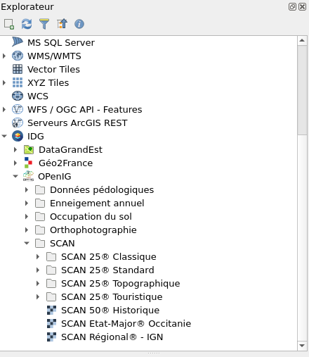

# IDG

Plugin pour QGIS 3 fournissant un accès simple aux données de l'ensemble des Infrastructure de Données Géographiques (IDG) et d'autres ressources nationales géographiques utiles.

Canal de discussions : https://matrix.to/#/!DqHgKIoltGIikFRreo:matrix.org

## Installation

Pré-requis :

* QGIS version LTR [3.28] ou supérieure
* Une connexion Internet

* Installation depuis le fichier zip : télécharger depuis la derniere [release](https://github.com/geo2france/idg-qgis-plugin/releases) depuis le dépot github.
* Installation depuis le dépot de développment : ajouter le dépot `https://www.geo2france.fr/public/qgis3/plugins/plugins-dev.xml` dans le gestionnaire d'exentions (Extensions > Installer/Gérer les extensions) de QGIS et activer les extensions expérimentales.

## Utilisation

### Administrateur

Créer un nouveau projet et y ajouter les couches que vous souhaitez diffuser.
> **Warning**
> Les couches doivent pouvoir être accessible depuis n'importe où (fichiers distants, flux WMS/WFS, etc.), il ne doit **pas** s'agir de fichiers locaux.

Il est recommandé d'[organiser les couches en groupes et sous-groupes](https://docs.qgis.org/3.22/fr/docs/user_manual/introduction/general_tools.html#group-layers-interact).

Dans les propriétés du projets, remplir les champs suivants :

- **Métadonnées > Identification > Titre** : Le nom de la plateforme qui sera visible par l'utilisateur (ex : Geo2France)
- **Métadonnées > Identification > Résumé** : Facultatif, une brève présentation qui sera visible au survol
- **Métadonnées > Liens** : Vous pouvez ajouter ici des liens vers les différents services de votre plateforme (ex : contact, catalogue, etc.) 
   Ceux-ci seront accessibles à l'utilisateur via un clic droit sur le nom de la plateforme

Pour chaque couche, vous pouvez définir :
- Un titre et un résumé (_Propriété > Métadonnées > Identification_)
- Une symbologie
- Une URL de métadonnées : créer un lien nommé "Metadata" dans les propriété de la couche (_Propriété > Métadonnées > Liens_)

Enregistrez le fichier projet (qgs ou qgz) et déposez le sur un un serveur web (serveur HTTP, Github, cloud, etc.).

[TODO] Procédure pour enregistrer la plateforme dans les plateformes par défaut du plugin (quel fichier éditer ?).

### Utilisateur

Dans le panneau _navigateur_ sur la gauche, double-cliquez sur l'icone **IDG** : cela déroulera les différentes plateformes disponibles.

Pour ajouter de nouvelles plateformes, mettre à jour le plugin ou ajouter l'url fournie par l'administrateur dans _préférence > IDG_

## Conception

### Auteurs

* Benjamin Chartier, Jean-Baptiste Desbas

### Source d'inspiration

* Nicolas Damiens

### Contributeurs

[TODO]

### Autres remerciements

* [Julien Moura](https://github.com/Guts) (Oslandia) pour le [template](https://oslandia.gitlab.io/qgis/template-qgis-plugin/) du plugin.
* Auteurs des icônes de QGIS, reprises dans l'arbre des ressources
* Pour le fichier plugin/geo2france/images/Icon_Simple_Warn.png cf.
<https://commons.wikimedia.org/wiki/File:Icon_Simple_Warn.png>

## Licence

GNU Public License (GPL) Version 2
